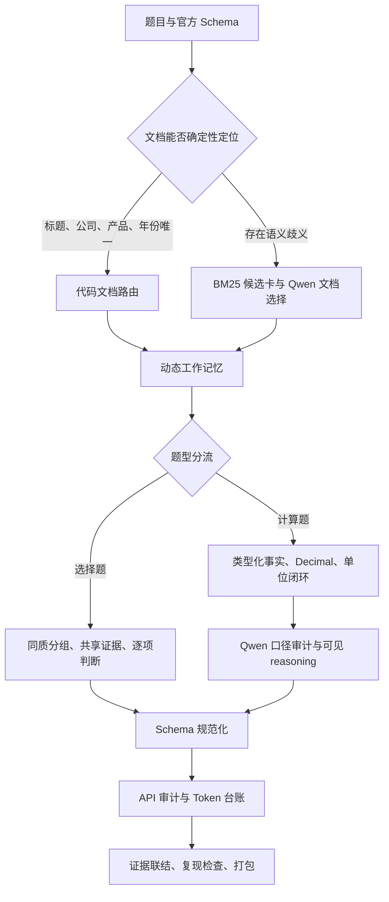

# Router6 单次端到端复现架构

## 核心思想

系统不让 Qwen 从全部金融长文中暴力寻找答案，而是把题目编译成一个有来源、有限额、
可审计的动态工作记忆。代码处理确定性结构，Qwen 处理语义判断，两者在同一次运行中
互相校验。



## 六层结构

### 1. 文档与长期记忆

- 原文按 `doc_id / page / chunk_id` 保存，页码可回溯。
- 保险条款生成产品绑定的原句胶囊。
- 财报事实绑定公司、年份、合并/母公司口径、单位和页码。
- 合同、法规和研报生成来源绑定的叙述事实原子。
- 全部检索为词法 BM25，不使用 embedding。

### 2. 文档路由

标题、公司、产品或唯一事实束能直接定位时使用零 Token 代码路由；其余问题先做文档级
BM25 粗召回，再由 Qwen 从候选卡中选择。路由只读取题面、选项和语料元数据。

### 3. 动态工作记忆

每题分别检索题干和所有选项，加入年份、季度和金融同义写法扩展。每个选项的最佳原文块
进入保护集合，每份选中文档至少保留一块正文。字符预算只淘汰普通块，防止关键反证被
全局高分证据挤出。

### 4. 双执行通道

选择题按领域、文档底仓和可见语义结构分组，共享提示词和证据底仓，但保留独立答案与
reasoning 区块。深层法律例外和合并/母公司冲突题会被隔离。

计算题先尝试类型化事实与 `Decimal` 闭式求解；成功后仍由 Qwen 审查主体、期间、口径、
单位、公式与舍入，并生成最终可见 reasoning。任何事实冲突、单位不闭合或答案槽不一致
都会进入完整 Qwen 回退路径。

### 5. Token 调度与守恒

所有 Token 采用 DashScope 返回的原始 usage。共享调用使用稳定最大余数法分摊：prompt
按题目实际拥有的提示字符权重，可见 completion 按答案区块，隐藏 reasoning 按 prompt
权重。逐题整数分摊之和始终严格等于服务商调用总量。

### 6. 冻结与复现

运行开始即记录完整题目顺序、输入哈希、模型、配置、Git 提交和正式运行时文件清单。
最终检查要求答案、reasoning、API 调用、Token 台账和证据链互相闭合；打包器再对 ZIP
成员集合、字节数和 SHA-256 建立闭包。

## 关键入口

- `work/generate_answer.sh`：一键正式入口。
- `work/agent/run_b2.py`：100 题路由与并发编排。
- `work/agent/answerer.py`：动态证据召回和单题语义作答。
- `work/agent/batch.py`：选择题同质分组与共享证据批答。
- `work/agent/calc.py`：计算题确定性求解、口径审计和回退。
- `work/agent/qwen_client.py`：Qwen 调用、原始审计和 Token 守恒。
- `work/agent/repro.py`：运行时文件闭包与哈希冻结。
- `work/script/check_reproduction.py`：零 API 严格复现验收。

## 最终运行数据流

```text
question_b + submit.csv
  -> 文档路由
  -> 动态工作记忆
  -> 选择题共享批答 / 计算题闭式求解与 Qwen 审计
  -> Schema 格式化
  -> answer.csv + API audit + token ledger
  -> evidence.json
  -> reproduction checker
  -> submission.zip
```
